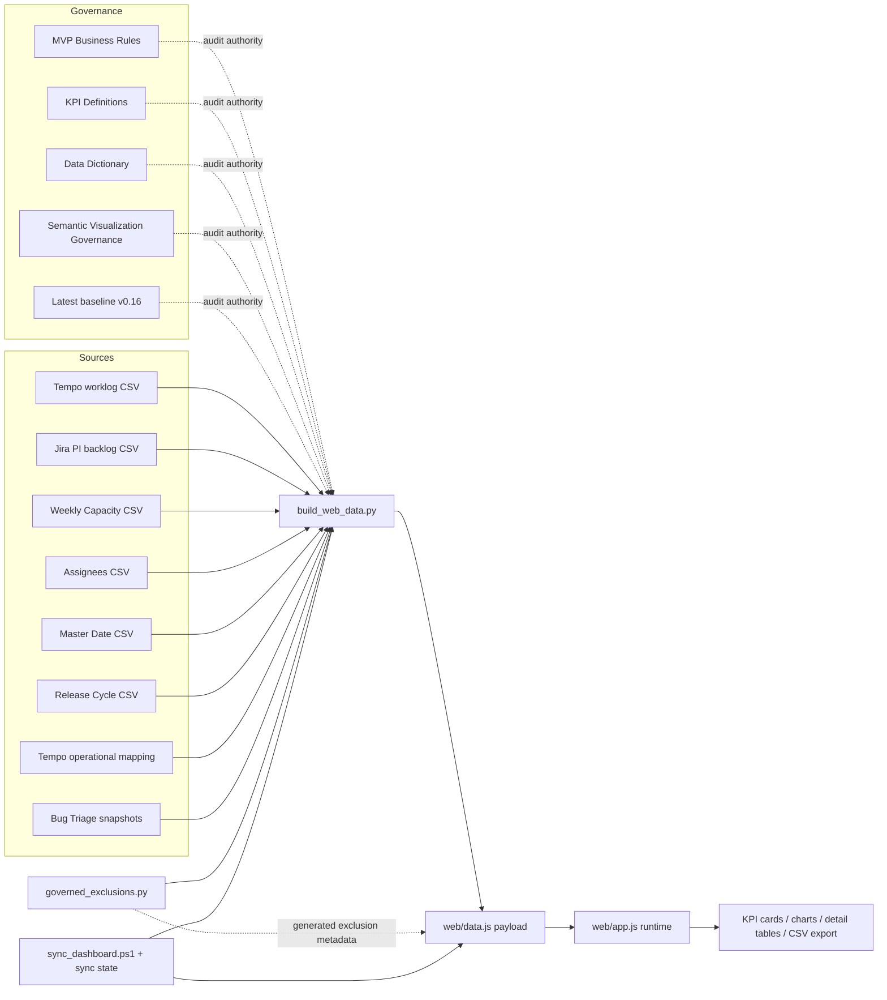
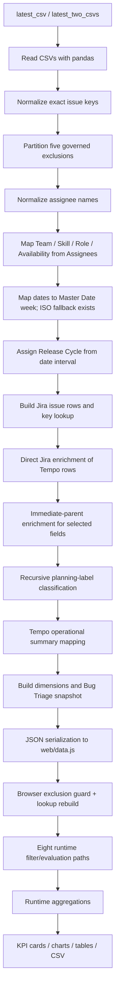
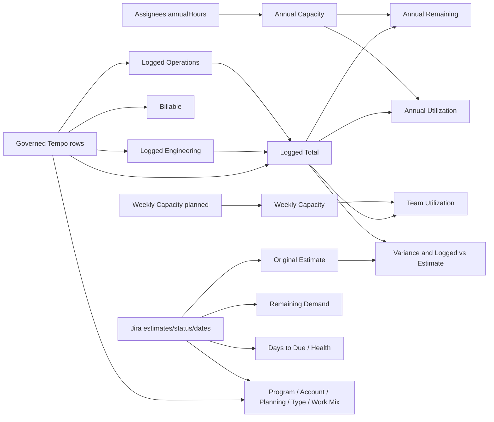
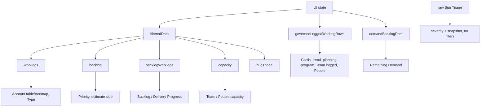
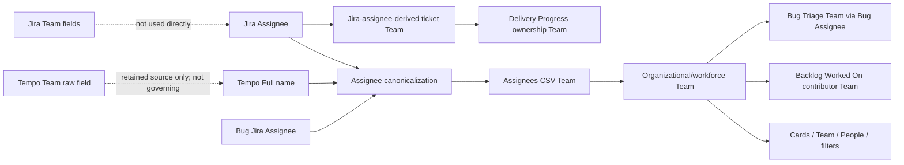

# Current Architecture and Dependency Graph

Audit extraction date: 2026-09-03 (Europe/Madrid)  
Repository root inspected: `C:\AI Projects\Codex_MVP`  
Scope: current files and generated payload only; no build, synchronization, test, validation, or regeneration command was run.

## 1. Executive Summary

The active dashboard is a static browser application. `scripts/build_web_data.py` selects the latest matching CSVs in `data/raw/`, applies centralized key exclusions, normalizes and enriches source rows, and serializes a single large payload to `web/data.js`. `web/index.html` loads that payload followed by `web/app.js`; nearly all KPI, filter, aggregation, chart, table, search, and CSV-export behavior is calculated again at browser runtime.

The current payload was generated for 2026-08-27 and contains 26,214 governed Tempo worklog rows, 1,708 Jira backlog rows, 2,014 capacity rows, 38 assignees, 730 Master Date rows, 11 release cycles, and 54 Bug Triage rows. The browser has eight materially distinct filter/evaluation paths rather than one universal filtered fact table. This is necessary in part (for example, current Jira demand and independent Bug Triage), but it also creates inconsistent propagation risks.

This audit identified:

- 27 material KPI/metric calculation paths.
- 8 distinct filter/evaluation paths.
- 14 duplicated or parallel logic areas.
- 10 governance/implementation conflicts or unresolved governance divergences.
- 5 dedicated validation/test assets; none is a fully independent source-to-render reconciliation suite.

The most consequential audit observations are: Account calculations use Tempo Account on the rendered chart/table while canonical governance specifies Jira Account; the demand chart uses Jira Remaining Estimate while calculation governance defines demand as Original Estimate; Master Date lookup has an ISO-week fallback; Delivery Health produces a different state set and thresholds than canonical KPI governance; Jira backlog is date-filtered by Jira Created Date in the shared path; and the generated Bug Triage comparison says there is no prior snapshot although a prior file exists and the current builder resolves it.

Traceability is partial. `data/.dashboard_sync_state.json` fingerprints the six primary sources selected for the payload, but `web/data.js` stores filenames and row counts rather than hashes, and the state omits Bug Triage and the Tempo operational mapping. `web/app.js` is also newer than `web/data.js`, so the exact runtime-code/payload pairing is not recorded as a single immutable manifest.

### Overall architecture



## 2. Repository Map

Only files relevant to dashboard generation, runtime, governance, traceability, validation, or parallel/legacy output are listed.

```text
C:\AI Projects\Codex_MVP
├─ BASELINE_v0.2...v0.16_2026-08-26.txt       [Governance/history]
├─ data
│  ├─ .dashboard_sync_state.json              [Configuration/state]
│  ├─ raw
│  │  ├─ RAW_DATA_FULL_ANALYSIS_01_Jan_26_27_Aug_26.csv
│  │  ├─ All Jira Work Items marked PI Backlog (JIRA)_20260827.csv
│  │  ├─ Weekly Capacity_20260826.csv
│  │  ├─ 20260307_Assignees_Capacity.csv
│  │  ├─ 20260307_Master_Date - Master Date PBI.csv
│  │  ├─ Release Cycle.csv
│  │  ├─ Bug Triage_20260827.csv.csv
│  │  └─ Bug Triage_20260805.csv               [Raw data/snapshots]
│  └─ mappings
│     └─ tempo_operational_mapping.csv          [Mapping/reference]
├─ docs
│  ├─ governance
│  │  ├─ MVP_Business_Rules.md
│  │  ├─ KPI_Definitions.md
│  │  ├─ Data_Dictionary.md
│  │  ├─ Semantic_Visualization_Governance.md
│  │  ├─ Calculation_Governance.md
│  │  ├─ Release_Cycle_Governance.md
│  │  ├─ Forecasting_Governance.md
│  │  └─ Forecast_Resolution_Specification.md  [Governance]
│  └─ user-guides/User_Guide.md                [Runtime documentation]
├─ scripts
│  ├─ governed_exclusions.py                   [Business rule authority]
│  ├─ build_web_data.py                        [Active ETL/payload builder]
│  ├─ sync_dashboard.ps1                       [Source selection/synchronization]
│  ├─ test_global_tempo_exclusions.py          [Unit/payload consistency]
│  ├─ validate_bug_triage_assignees.cjs        [Generated-output validation/report]
│  ├─ validate_delivery_progress_team_ownership.cjs
│  ├─ verify_bi_app_chrome_cdp.mjs             [Current broad browser regression]
│  ├─ verify_bi_app.cjs                        [Older browser smoke test]
│  ├─ profile_sources.py                       [Legacy/diagnostic profiler]
│  ├─ prepare_dashboard_data.py                [Legacy parallel ETL]
│  └─ build_dashboard.mjs                      [Legacy workbook generator]
├─ web
│  ├─ index.html                               [Frontend structure]
│  ├─ app.js                                   [Runtime calculations/rendering]
│  ├─ styles.css                               [Presentation]
│  ├─ data.js                                  [Generated active payload]
│  ├─ verification-desktop.png
│  ├─ verification-mobile.png
│  └─ verification-utilization-chart.png       [Generated validation evidence]
└─ outputs/bi_dashboard
   ├─ dashboard_data.json                      [Legacy generated payload]
   ├─ delivery_management_bi_dashboard.xlsx    [Legacy generated workbook]
   ├─ *_preview.png                            [Legacy generated previews]
   └─ bug_triage_unmapped_assignees.csv        [Validation artifact]
```

Classification notes:

- Active generation/runtime: `governed_exclusions.py`, `build_web_data.py`, `sync_dashboard.ps1`, `web/data.js`, `web/index.html`, `web/app.js`, and `web/styles.css`.
- The workbook branch (`prepare_dashboard_data.py` → `dashboard_data.json` → `build_dashboard.mjs` → `.xlsx` and previews) is parallel and currently stale. Its hardcoded source paths point to repository-root files that are absent in the current workspace.
- `profile_sources.py` has the same obsolete repository-root source convention.
- `verify_bi_app.cjs` expects at least six KPI cards while the current dashboard and current CDP harness require exactly four; it is likely obsolete.
- `.tmp/` contains diagnostic images, Chrome profiles, logs, and prior validation extracts. These do not feed runtime and were excluded from the architecture, except as historical evidence that prior investigations occurred.

## 3. End-to-End Data Flow

### Active production path



1. **Selection.** `build_web_data.py:parse_export_date`, `latest_csv`, and `latest_two_csvs` select files by filename date where recognized, then mtime. `sync_dashboard.ps1:Get-ExportDate` and `Get-LatestRawFile` independently implement the same selection concept.
2. **Ingestion.** `main` reads all CSVs with pandas. No database or API participates at runtime.
3. **Exclusion.** `partition_governed_issue_rows` trims and uppercases keys and removes the five exact governed keys from Tempo, Jira, and operational mapping before downstream use. Per-key excluded-source impact is retained only in `meta.excludedTempoWorkItems`.
4. **Calendar.** `apply_master_date_week` maps Tempo Work Date to Master Date Week Number and workday. Missing dates fall back to ISO week and weekday calculation. Release Cycle is independently determined by `release_for_date` against Release Cycle start/end intervals.
5. **People mapping.** Names are normalized/canonicalized; Team, Skill, Role, and Availability are joined by canonical Assignee name. The valid Team dimension is the intersection of Assignees teams and capacity teams.
6. **Jira normalization.** Jira dates, parent key, labels, fix version, program, Account, estimates, status, priority, Team/Skill (via Jira Assignee), and hierarchy are projected into `backlog`.
7. **Tempo/Jira joins.** Both `worklogs` and `backlogWorklogs` start at Tempo worklog grain. Direct join key is Tempo `Work Item Key` → Jira `Issue key`. `backlogWorklogs` then receives detailed fields and immediate-parent fallback for Account, Delivery, Target Release, and Fix Version only when the direct Jira key is absent and the parent exists.
8. **Planning classification.** `resolve_planning_classification` walks child/parent/ancestor Jira labels until Planned, Unplanned, `tempo-ticket`, conflict, missing parent, or cycle. It is the only recursive hierarchy traversal; Account fallback remains immediate-parent only.
9. **Operational mapping.** `tempo_operational_mapping.csv` replaces summary for mapped Tempo keys and marks metadata source. Tempo rows receive operational placeholder values in the generated structure.
10. **Dimensions.** Build-time arrays are produced for Teams, Skills, Programs, Statuses, Issue Types, Assignees, capacity, Master Dates, releases, and Bug Triage.
11. **Serialization.** The complete payload is emitted as `window.BI_DATA = {...};` in `web/data.js`.
12. **Browser boundary.** `applyGlobalIssueExclusions` repeats normalization and strips excluded keys from five arrays using generated metadata. `rebuildLookups` rebuilds people/team/skill/Jira indexes.
13. **Filtering.** `filteredData`, `governedLoggedWorklogRows`, `loggedEffortData`, `peopleDetailData`, `demandBacklogData`, `programDistributionEffortData`, and direct raw Bug Triage calls provide different scopes.
14. **Aggregation/rendering.** `renderKpis`, chart-specific grouping functions, `groupAccounts`, `groupPeople`, `backlogWorkedRows`, `deliveryProgressRows`, `bugTriageRows`, and `downloadSnapshot` compute final outputs in the browser.

### Current population checkpoints

| Checkpoint | Current result |
|---|---:|
| Raw Tempo rows | 29,857 |
| Excluded Tempo rows | 3,643 |
| Generated governed Tempo rows | 26,214 |
| Generated distinct Tempo work item keys | 2,777 |
| Tempo rows with blank governed Team | 716 |
| Direct-Jira `backlogWorklogs` rows | 8,318 |
| Immediate-parent metadata rows | 4,448 (740 distinct keys) |
| Tempo-operational-mapping rows | 8,553 |
| Unresolved metadata rows | 4,895 |
| Jira rows | 1,708, all distinct keys |
| Jira rows with parent key | 1,141 |
| Weekly capacity raw/nonblank rows | 52,523 / 2,014 |
| Current Bug Triage rows/distinct keys | 54 / 54 |

## 4. Source Dependency Matrix

| Source | Selected file / selection | Grain and primary key | Join keys | Main transformations/exclusions | Fields consumed | Generated structures | Dependent surfaces |
|---|---|---|---|---|---|---|---|
| Tempo | `RAW_DATA_FULL_ANALYSIS_01_Jan_26_27_Aug_26.csv`; latest `RAW_DATA_FULL_ANALYSIS_*.csv` | One worklog; `Tempo Worklog ID` is unique (29,857/29,857) | `Work Item Key` → Jira `Issue key`; `Full name` → Assignees `Assignee`; `Work date` → Master Date; date → release interval | Five-key exclusion; valid date; name canonicalization; Team/Skill/Role mapping; hours numeric; direct Jira enrichment; planning classification | Work Item key/summary/type/status/priority, parent, Work date, Full name, Account fields, Client, Version, Product Module, Task Type, Logged/Billable Hours | `worklogs`, `backlogWorklogs`; metadata date range and exclusion impact | Logged KPIs, trend, Team, planning, Program, Account, People, Backlog Worked On, Delivery Progress, type/mix, CSV |
| Jira PI backlog | `All Jira Work Items marked PI Backlog (JIRA)_20260827.csv`; latest matching export | One issue; `Issue key` unique (1,708/1,708) | Issue key direct; immediate parent key; Assignee → Assignees | Five-key exclusion; date parsing; first available repeated Start/Fix/Labels/Parent column; Program allow-list normalization; estimates seconds→hours | Key, summary, type, status/category, priority, parent, dates, Account, Program, Delivery, Target Release, Fix Version, Product Module, technical debt, Assignee, estimates | `backlog`, `statuses`, `programs`, `issueTypes`; enriches Tempo arrays | Demand, estimates, status/program/type filters, Backlog metadata, Delivery Progress ownership/health, Account estimate side |
| Weekly Capacity | `Weekly Capacity_20260826.csv`; latest `Weekly Capacity_*.csv` | Assignee-week; 2,014 nonblank rows and distinct Assignee/Week pairs across 53 weeks; raw file has 52,523 rows because most Assignee rows are blank | Assignee → Assignees; Week Number → selected Master Date week set | Drop blank Assignee/week; numeric week/hours; map people attributes; keep only valid Teams | Assignee, Week Number, Planned Hours | `capacity`, `teams`, `skills` summaries | Team Utilization capacity bars, People Capacity/utilization; filter dimension validity |
| Assignees | `20260307_Assignees_Capacity.csv`; latest `*Assignees*Capacit*.csv` | One governed person; Assignee unique (38/38) | Canonical Assignee name from Tempo/Jira/Capacity/Bug Triage | Whitespace/accent/punctuation-insensitive lookup; Team must also have capacity records | Team, Assignee, Role, Skill, Availability, Actual Annual Hours | `assignees`, `teams`, `skills`; mapped attributes in facts | Annual cards, organizational filters, People, Team chart, backlog activity, Delivery ownership resolution, Bug Triage mapping |
| Master Date | `20260307_Master_Date - Master Date PBI.csv`; latest `*Master*Date*.csv` | One date; 730 unique dates | Work Date string → Master Date | Date/Week projection; weekday derivation; ISO/weekday fallback if not matched | Master Date, Week Number, WeekDay Name | `masterDates`; `week`, `isWorkday` on Tempo rows | Date-range→capacity-week selection; week trend; workday metadata |
| Release Cycle | `Release Cycle.csv`; latest `Release Cycle*.csv` | One release interval; 11 unique release cycles | Work date between Start and End | Parse dates and first inclusive interval match | Release Month/Cycle, Start/End | `releases`; `releaseCycle` on Tempo rows | Hidden Release Cycle filter, active only if state is programmatically populated |
| Tempo operational mapping | `tempo_operational_mapping.csv`; fixed path, not latest-pattern | One key; 22 unique raw keys, 20 after exclusion | normalized `Key` → Tempo work item key | Five-key exclusion removes two mapping rows present in this file; summary lookup | Key, Summary | `tempoOperationalMappings` and duplicate `tempoDescriptions`; enriched operational summary | Backlog/Delivery operational labels, browser exclusion guard |
| Jira Bug Triage | Current `Bug Triage_20260827.csv.csv`, prior `Bug Triage_20260805.csv`; latest two `Bug Triage_*` by parsed date/mtime | One exported issue, then one distinct Bug key; 54 current unique, 46 previous unique | Assignee → Assignees only; key-set comparison between snapshots | Keep Issue Type=Bug and nonblank key; first duplicate; direct values only | Key, Summary, Bug Severity, Status, Updated, Assignee | `bugTriage`; `meta.bugTriageSummary`; comparison metadata | Independent severity chart, snapshot banner, Bug Triage table, unmapped-assignee report |

Important source ownership split: `worklogs.account` is Jira-enriched, while `worklogs.tempoAccount` remains the Tempo Account Name. Several runtime paths choose one or the other; this is central to the Account conflict recorded in section 14.

## 5. KPI Lineage Matrix

The 27 material calculation paths below include the four card KPIs, detail-table measures, and chart/banner metrics that materially affect dashboard interpretation. “Ignored” describes implementation behavior, not an endorsement.

| # | KPI / metric | Source → input | Calculation / function | Grain | Applied filters | Intentionally or effectively ignored | Render location |
|---:|---|---|---|---|---|---|---|
| 1 | Annual Workforce Capacity | Assignees `annualHours` | `renderKpis`: sum eligible `raw.assignees` | Assignee | Team, Assignee, Skill; other filters constrain to active people/teams through logged scope | Date/week, status directly; Jira metadata has only indirect active-scope effect | Card |
| 2 | Actual Hours / governed Logged Total | Tempo `logged` | `governedLoggedWorklogRows` → managed Team → `sum`; equals Eng + Ops | Worklog | Date, Team, Assignee, Skill, Jira Account, category, Jira priority, target release, resolved Program, release cycle | Status | Card; common logged side |
| 3 | Annual Capacity Remaining | #1 − #2 | `renderKpis` | Mixed assignee/worklog | Inherits #1/#2 asymmetry | Status on logged side | Card |
| 4 | Annual Capacity Utilization | #2 / #1 | `renderKpis` | Mixed assignee/worklog | Inherits #1/#2 asymmetry | Status on logged side | Card |
| 5 | Weekly Capacity | Weekly Capacity `planned` | `filteredData.capacity`; `sum`/`groupSum` | Assignee-week | Date-derived Master Date weeks, Team, Assignee, Skill | Account/category/priority/status/release/program except indirectly in annual card | Team chart, People table |
| 6 | Logged Engineering | Tempo `logged`, key not `TEMPO-*` | `groupPeople`; common governed scope | Worklog/person | Same as governed logged scope | Status | People table/totals; work-mix denominator |
| 7 | Logged Operations | Tempo `logged`, key `TEMPO-*` after exclusions | `groupPeople` | Worklog/person | Same as governed logged scope | Status | People table/totals |
| 8 | Billable | Tempo `billable` | `groupPeople`; trend grouping | Worklog/person/time | Governed logged filters | Status; capacity | People table; Hours Trend |
| 9 | Original Estimate | Jira `originalEstimateHours` | `groupAccounts`, dedupe by Account+key | Jira issue/Account | Shared Jira backlog path: date-as-Created, Team, Assignee, Skill, Account, Priority, Status, Target Release, Program, Fix Version/release | Account Category | Accounts table/tooltips |
| 10 | Logged vs Estimate % | Logged / Original Estimate | `groupAccounts`, `accountTotalsRow` | Account | Mixed logged and estimate scopes | Status ignored on logged side | Accounts table |
| 11 | Variance Hours | Logged − Original Estimate | same | Account | Mixed scopes | Status ignored on logged side | Accounts table; Account tooltip |
| 12 | Work Items | Distinct keys/issue keys depending surface | card `distinctCount`; `groupPeople`; `groupAccounts`; treemap set | Work item | Surface-specific | No single canonical path | Card note, Account/People tables/tooltips |
| 13 | Hours Trend | Tempo logged and billable | `renderTrendChart`: sum by month or `Wnn` | Worklog/time bucket | Governed logged scope | Status | Hours Trend |
| 14 | Planned vs Unplanned | Tempo logged; Jira Planned/Unplanned/tempo-ticket labels | build `resolve_planning_classification`; runtime `planningEffortRows` | Work item then category | Governed logged scope | Status; missing/conflict retained as Unclassified | Chart bars count items; summary shows hours |
| 15 | Program Distribution | Tempo logged; Jira child/parent Program | `resolveProgramForWorklog`, `programDistributionRows` | Worklog/Program | Governed logged filters; Program handled inside chart | Status; unresolved remains separate metric | Program pie + three totals |
| 16 | Bug Triage snapshot counts | Current/prior Bug keys | build `jira_key_set`, `compare_jira_key_sets` | Distinct key snapshot | None | All global filters/search/sort | Snapshot banner |
| 17 | Bug Severity Distribution | Current Bug Triage key/severity | `bugSeverityDistributionRows`, dedupe key, omit blank severity | Distinct Bug key | None | All global filters | Severity chart |
| 18 | Account Distribution logged | Tempo `tempoAccount`, `logged` | `governedTempoAccountAggregation` | Worklog/Tempo Account | `filteredData.worklogs`: Date, Team, Assignee, Skill, Tempo Account, category, Tempo-export priority/version, direct Program, release | Status | Treemap |
| 19 | Account Distribution estimate/variance tooltip | Jira Account and Original Estimate | `accountTreemapRows` adds filtered Jira estimates to Tempo-account buckets | Account/Jira issue | Shared backlog filters | Status ignored only on Tempo side | Treemap tooltip |
| 20 | Team Utilization | Tempo logged / Weekly Capacity planned | `renderTeamChart`, `utilizationBars` | Team | Governed logged + selected capacity weeks | Status | Team Utilization chart |
| 21 | Remaining Demand | Jira `remainingEstimateHours` for selected Jira rows | `demandBacklogData` → `renderRemainingDemandChart` | Jira issue/Team | Team, Assignee, Skill, Account, Priority, Status, Target Release, Program, Fix Version/release | Date Range, Account Category | Remaining Demand chart |
| 22 | Demand-chart Logged Effort | governed Tempo logged | grouped by contributor Team | Worklog/Team | Governed logged scope | Status | Same chart |
| 23 | Backlog Priority | Jira issue count by Priority | `filteredData.backlog` → `groupCount` | Jira issue | Date Range applied to Created Date plus Team/Assignee/Skill/Account/Priority/Status/Target/Program/release | Account Category | Backlog Priority chart |
| 24 | Engineering Work Mix | Tempo logged; Jira issue type and technical-debt flag | `engineeringWorkMixRows`: Bugs, Technical Debt, Rest; Operations excluded from denominator | Work item/category | Governed logged scope | Status | Donut + summary |
| 25 | Work Item Types | Jira-enriched Tempo rows | `renderTypeChart`: count worklog rows by nonblank Jira `itemType` | Worklog row/type | `filteredData.worklogs` path | Operational types without Jira type; status applies here unlike governed logged path | Work Item Types chart |
| 26 | Last Worklog Date | Tempo Work Date | max lexical ISO date per key in `backlogWorkedRows` / `deliveryProgressRows` | Work item | Activity/detail path | Jira Updated/Created | Backlog and Delivery Progress |
| 27 | Days to Due / Delivery Health | Jira Due Date, status/category; payload current date | `deliveryDueState`, `durationLabel` | Work item | Delivery Progress scope | No dedicated Delivery Health filter | Delivery Progress |

### KPI dependency sketch



## 6. Filter Dependency Matrix

### Eight implementation paths

1. `filteredData.worklogs`: historical Tempo projection using Tempo Account/category/priority/version fields plus direct Jira Program/status enrichment.
2. `filteredData.backlog`: Jira issue inventory, including Date Range applied to Jira Created Date.
3. `filteredData.backlogWorklogs`: activity rows with detailed Jira/parent enrichment and special default-status behavior.
4. `filteredData.capacity`: capacity by Master-Date-derived week set and people dimensions only.
5. `filteredData.bugTriage`: Team/Assignee/Skill and only a non-default active Status selection.
6. `governedLoggedWorklogRows`/`loggedEffortData`: managed historical logged scope; status ignored and Account/Priority/Target use Jira-enriched `backlogWorklogs`.
7. `demandBacklogData`: current Jira snapshot; Date Range and Account Category ignored.
8. Direct independent raw paths: Bug Severity and snapshot banner use `raw.bugTriage`/metadata and ignore all filters; Release Cycle is hidden but remains in state/data; component search/sort is post-filter.



Legend: `✓` applies; `~` partial/different field or special handling; `—` ignored/not available; `H` control hidden.

| Requested filter | Worklogs path | Jira backlog | Backlog worklogs | Capacity | Bug Triage table | Governed logged | Current demand | Independent Bug chart/banner | Notes / leakage risk |
|---|---:|---:|---:|---:|---:|---:|---:|---:|---|
| Team | ✓ contributor | ✓ Jira-Assignee mapping | ✓ contributor | ✓ | ✓ Bug Assignee mapping | ✓ contributor | ✓ Jira ownership | — | Delivery Progress bypasses contributor Team then reapplies Jira ownership Team. |
| Assignee | ✓ Tempo person | ✓ Jira assignee | ✓ Tempo person | ✓ | ✓ Jira assignee | ✓ Tempo person | ✓ Jira assignee | — | Delivery Progress additionally rejects a key if any full-scope contributor or Jira assignee is unmapped. |
| Skill | ✓ mapped person | ✓ Jira assignee skill | ✓ contributor skill | ✓ | ✓ Bug assignee skill | ✓ contributor skill | ✓ Jira assignee skill | — | Same label, different person semantic. |
| Date Range | ✓ Work Date | ~ Created Date | ✓ Work Date | ~ any Master Date week represented | — | ✓ Work Date | — | — | Partial weeks include the full capacity week. Jira Created Date filtering conflicts with stated backlog/demand governance. |
| Week | No explicit control; row week used for trend | — | — | derived from Date Range | — | implicit via dates | — | — | `Week Number` is canonical but not exposed as a selectable global filter. |
| Account | ~ Tempo Account | ✓ Jira Account | ✓ Jira/parent Account | — | — | ✓ Jira/parent Account | ✓ Jira Account | — | Same selected value is evaluated against different source fields. |
| Account Category | ✓ Tempo | — | ✓ Tempo | — | — | ✓ Tempo | — | — | Does not propagate to Jira estimate/demand rows. |
| Priority | ~ Tempo-export field | ✓ Jira | ✓ Jira/parent detail | — | — | ✓ Jira-enriched | ✓ Jira | — | Facet values come from raw worklogs, not Jira status dimension style. |
| Status | ✓ direct Jira status, including default | ✓ including default | ~ only non-default status is active | — | ~ only non-default status | — | ✓ including default | — | Default selection affects Jira demand but not governed logged or activity backlog; explicit non-default status affects additional paths. |
| Delivery | — | field exists but no state/control | — | — | — | — | — | — | Requested/canonical filter not implemented. |
| Target Release | ~ Tempo Version on `worklogs` | ✓ Jira | ✓ Jira/parent | — | — | ✓ Jira/parent | ✓ Jira | — | Same state can compare Tempo Version vs Jira Target Release. |
| Fix Version | — | represented indirectly by hidden `releases` state using Jira Fix Version | — | — | — | — | ~ hidden release state | — | No visible Fix Version filter. |
| Program | ✓ direct/parent runtime resolution | ✓ normalized Jira Program | ✓ child/ancestor resolution | — | — | ✓ | ✓ | — | Distribution calls an ignore-Program source then handles selection internally to keep unresolved totals. |
| Release Cycle | H date-derived cycle | H Jira Fix Version is compared to release-cycle labels | H date-derived cycle | — | — | H | H Jira Fix Version | — | Control is intentionally hidden, but field comparisons are not semantically uniform if state is populated. |
| Delivery Health | — | — | — | — | — | — | — | — | No filter state/control; health is derived only after Delivery Progress rows are built. |

Other filter behavior:

- Details search is post-aggregation and post-filter; it does not change KPI/chart totals.
- Table sorting and row caps (120 Accounts/Backlog/Delivery/Bug, 80 People) occur after footer totals are calculated.
- CSV export always exports the Accounts calculation path, regardless of the active detail tab.
- Status is the largest exception: `loggedEffortData` always ignores it, while `filteredData.backlog` always evaluates the default non-Done selection, and `backlogWorklogs`/Bug Triage treat default selection as inactive.

## 7. Team Semantic Paths



### 1. Organizational/workforce Team

- Authority: Assignees CSV `Team`.
- Build path: canonical Tempo/Jira/Capacity/Bug Assignee → `team_by_assignee` in `build_web_data.py`.
- Valid Team domain: intersection of Assignees teams and Teams represented in nonblank Weekly Capacity rows.
- Browser repeats mapping using `teamByPerson`, `governedTeamForPerson`, and `enrichGovernedWorklog`.
- Consumers: annual cards, Team Utilization, People, Team filter dimension, logged-effort scope, capacity, Bug Triage mapping.

### 2. Backlog Worked On contributor Team

- Source: Tempo worklog contributor → Assignees Team.
- `filteredData.backlogWorklogs` applies `state.teams` to each activity row before `backlogWorkedRows` groups by work item key.
- A key appears if at least one selected contributor-Team row exists in the selected activity scope. Displayed Backlog columns do not include Team, so the semantic is only visible through filter effect.

### 3. Delivery Progress ownership Team

- Source: Jira issue Assignee → Assignees Team, stored on `backlog.team`.
- `renderDetails` deliberately calls `filteredData({ignoreTeam:true}).backlogWorklogs`, then `deliveryProgressRows` obtains `deliveryProgressTicketTeamForKey(key)` from the Jira row and applies selected Teams under ownership semantics.
- Tempo-only keys have no Jira ticket Team and are included only when no Team is selected, subject to assignee validity; their displayed Team is `-`.
- The current implementation additionally requires every full-scope logged contributor and the Jira assignee to be present in the Assignees dimension. This is an extra row-inclusion gate, not merely ownership display.

### Mixing/flattening risks

- `backlog.team` is not a direct Jira Team field; it is Jira ticket ownership inferred through Jira Assignee and the organizational mapping. This matches the current stated ownership path but should not be described as raw Jira Team.
- The global Team control changes semantics by component: contributor Team for historical effort and Backlog Worked On; Jira-assignee ownership Team for Jira demand and Delivery Progress; Bug-assignee organizational Team for Bug Triage.
- `backlogTeam(row)` prefers stored `row.team` and falls back to the Assignees mapping. This helper is reused for both organizational and ownership contexts, making semantic intent dependent on the dataset passed.
- The Delivery Progress all-contributor validity gate can remove a Jira-owned item because of an unmapped Tempo contributor, even when the Jira owner maps successfully.

## 8. Parent/Child and Hierarchy Logic

### Direct Jira construction

- Parent candidates are the first nonblank among `Parent key`, `Custom field (Parent ticket)`, `Custom field (Epic Link)`, `Epic Link`, and suffixed duplicate columns.
- Jira `parentSummary` uses exported Parent summary, then falls back to the summary of the indexed parent key.
- `jira_by_key`/`jiraByKey` is keyed by preserved Jira issue key; Tempo keys are not replaced.

### Tempo enrichment

- Direct joins use Tempo `Work Item Key` to Jira `Issue key`.
- `worklogs` receives only direct Account, Program, Issue Type, Product Module, Technical Debt, Status, and Status Category.
- `backlogWorklogs` receives direct summary, parent context, Product Module, Priority, Status, dates, Delivery, Target Release, and Fix Version.
- If the direct key is absent, non-TEMPO, and its immediate parent exists, only Account, Delivery, Target Release, and Fix Version may be inherited. Direct blank Jira fields are not replaced from parent.
- Summary fallback is not inherited into the data row from parent. At render time, `[Sub-task] {Parent Summary}` is used only when the child summary is blank and the row type looks like sub-task/child.

### Planning hierarchy

- `resolve_planning_classification` is recursive and can traverse beyond the immediate parent.
- Precedence at each level: `tempo-ticket` → Operations; conflicting Planned+Unplanned → Unclassified; one classification → Planned/Unplanned; otherwise continue to parent.
- It detects cycles and records inspected/missing keys and reasons.
- This recursive behavior is specific to planning labels and must not be confused with immediate-parent Account enrichment.

### Aggregation/double-count controls and risks

- Account original estimates are deduplicated by key within Account buckets.
- Backlog Worked On and Delivery Progress group worklogs to one row per key and compute latest Work Date.
- Delivery Progress then removes a root-looking row if its key also appears as another row's parent. This can suppress a legitimately active parent item when it is both directly worked and parent to another row.
- `accountTotalsRow.itemCount` and `peopleTotalsRow.itemCount` sum per-bucket counts; the same work item across multiple people can be counted multiple times in the People total, and an item whose Account semantics split across paths could be counted across Account buckets.
- Planning and Engineering Work Mix first collapse hours by key, reducing worklog duplication but choosing the first nonblank classification metadata encountered.

## 9. Exclusion Logic

Authoritative implementation set: `scripts/governed_exclusions.py:GLOBAL_EXCLUDED_ISSUE_KEYS`.

| Key | Governed reason | Current raw Tempo impact |
|---|---|---:|
| TEMPO-54 | Absence (Out Of Office) | 442 rows; 3,369.500 logged; 0 billable |
| TEMPO-92 | HR daily registration or vacation | 1 row; 0.017 logged; 0.017 billable |
| TEMPO-106 | Daily total working time (Legal Tracking) | 2,538 rows; 46.942 logged; 46.942 billable |
| TEMPO-111 | HR daily registration or vacation | 524 rows; 9.224 logged; 0 billable |
| TEMPO-112 | HR daily registration or vacation | 138 rows; 1,085.000 logged; 1,085.000 billable |

Paths inspected:

1. `partition_governed_issue_rows` normalizes exact keys and partitions Tempo, Jira, and operational mapping during active build.
2. Excluded Tempo impact is serialized to metadata; excluded Jira estimate impact is added if present.
3. Browser `applyGlobalIssueExclusions` reads generated `meta.excludedIssueKeys` and filters `worklogs`, `backlogWorklogs`, `backlog`, `tempoOperationalMappings`, and duplicate `tempoDescriptions` before lookup/filter/render.
4. Runtime helpers (`isExcludedOperationalItem`) guard `backlogWorklogs`, governed logged rows, Account aggregation, Work Mix, Backlog, Delivery Progress, and People again.
5. `test_global_tempo_exclusions.py` contains an independent expected constant for test oracle purposes and checks the generated payload.
6. The legacy preparation path imports the centralized partition function before its own aggregation.
7. Bug Triage intentionally bypasses these exclusions because its dedicated Jira export governs membership.

No current generated analytical array contains the five keys. The exclusions are centralized at build time and metadata-driven in the browser, but repeated runtime guards create several defense-in-depth paths. A bypass risk remains for any new payload array not added to `applyGlobalIssueExclusions` or new renderer that does not use a guarded scope.

## 10. Generated Data Model

`web/data.js` is a 55,902,891-byte JavaScript assignment, SHA-256 `1071C417BE95FC625E84FE71BACB6B3BF5B40326B2F163924987A05CE9D3EB1C`.

| Array/object | Rows/grain/key | Main fields/source | Downstream consumers |
|---|---|---|---|
| `meta` | Singleton | generated/current/min/max dates; source filenames/rows; notes; Program/Status/Skill/Issue Type/Bug summaries; exclusions | Initialization, dimensions, banners, footer, refresh, validation |
| `teams` | 6 Team rows; key Team | Assignees ∩ capacity; counts/hours | Team dimension/filter, charts, validation |
| `skills` | 3 Skill rows | Assignees/capacity summary | Skill filter/dimension |
| `programs` | 4 normalized Jira Programs | Jira Program allow-list/count | Program filter |
| `statuses` | 33 Jira statuses | Jira Status/category/count | Status default/filter |
| `issueTypes` | 14 types | Jira type joined to Tempo row counts | Metadata/validation |
| `worklogs` | 26,214 worklogs; no Tempo Worklog ID is retained | Core Tempo fields plus direct enrichment; includes both `account` and `tempoAccount` | Shared filters, Account path, Type, facet values |
| `backlogWorklogs` | 26,214 worklogs; original worklog ID not retained | Detailed Jira/parent/planning/operational enrichment | Governed logged path, Backlog, Delivery Progress, Program, People |
| `tempoOperationalMappings` | 20 keys | mapping Key/Summary after exclusion | Browser guard/reference |
| `tempoDescriptions` | 20 keys | exact duplicate of prior array | Browser guard; no distinct consumer found |
| `backlog` | 1,708 Jira issues; key | issue metadata, mapped Team/Skill, estimates, hierarchy | Jira filters, demand, priority, Account estimate side, Delivery ownership |
| `bugTriage` | 54 distinct Bug keys | dedicated export values + mapped Assignee/Team/Skill | table and independent severity chart |
| `capacity` | 2,014 assignee-week rows | planned hours + mapped dimensions | Team/People capacity |
| `assignees` | 38 assignees | organizational attributes and annual hours | lookups, annual cards, filters |
| `masterDates` | 730 date-week rows | Master Date | Date Range→capacity week selection |
| `releases` | 11 intervals | Release Cycle | hidden filter facet |

Calculation placement:

- **Build only:** source selection, exclusion partition, date parsing, Master Date/release assignment, canonical Assignee mapping, direct/parent enrichment, planning classification, dimension summaries, Bug snapshot set comparison.
- **Browser only:** active filtering; managed-team restriction; four card values; all displayed groupings/ratios/variance; due-state logic; details; search/sort/caps; CSV.
- **Both:** exclusion enforcement, assignee canonicalization, Team/Skill mapping, Program parent resolution, planning category interpretation, hierarchy presentation, status semantics, and many validation/reconciliation calculations.

Loss-of-grain note: the raw Tempo Worklog ID is not retained. Individual payload rows remain worklog-grain by row order/content but cannot be unambiguously tied back by their primary key.

## 11. Duplicate / Parallel Logic

Fourteen areas were identified. Duplication is recorded as audit surface, not automatically as error.

| # | Area | Locations | Difference / audit risk |
|---:|---|---|---|
| 1 | Source selection | `build_web_data.py` vs `sync_dashboard.ps1` | Similar filename-date rules maintained in Python and PowerShell; Bug filename with `.csv.csv` falls to mtime. |
| 2 | Exclusion normalization | `governed_exclusions.py`, browser guard, runtime component guards, test oracle | Backend is authoritative; browser is metadata-driven; component guards may drift for new arrays. |
| 3 | Assignee canonicalization | Python build and browser lookup | Similar accent/punctuation normalization implemented twice. |
| 4 | Team/Skill derivation | Build enrichment and `enrichGovernedWorklog` | Browser overwrites generated Team/Skill for governed logged scope but not every path. |
| 5 | Account aggregation | `accountFacetRows`, `groupAccounts`, `accountDistributionScope`, `governedTempoAccountAggregation`, `accountTreemapRows`, `downloadSnapshot` | Tempo Account for logged vs Jira Account for estimates/governed filters; same label can represent different ownership. |
| 6 | Program resolution | Python direct normalized Program/planning hierarchy and browser `resolveProgramForWorklog` | Browser adds immediate-parent Program resolution; filter path and chart reconciliation handle Program differently. |
| 7 | Planning classification | Python `resolve_planning_classification`; browser `planningCategory`/`planningEffortRows` | Build decides hierarchy; browser reinterprets TEMPO keys and collapses by key. |
| 8 | Parent/summary presentation | Build parent fill/inheritance; browser detail helpers; local duplicates inside `backlogWorkedRows` | Placeholder and child detection rules are repeated with regex heuristics. |
| 9 | Delivery Progress ownership | `web/app.js` and `validate_delivery_progress_team_ownership.cjs` | Validation script reimplements production logic and includes hardcoded ADF-2326 behavior. |
| 10 | Capacity/utilization/remaining formulas | Cards, Team chart, People table/totals, legacy ETL/workbook | Annual vs weekly denominators and filter scopes differ by surface. |
| 11 | Status semantics | default status dimension, `filteredData` three fact paths, governed logged ignore, demand path | Default status is active for Jira but treated inactive for Backlog Worklogs/Bug Triage and ignored for logged effort. |
| 12 | Time/week/release logic | Master Date build, browser date→week set, release interval build, hidden release state, legacy ISO week | Current active dates are covered, but fallback/legacy and yearless week matching are parallel semantics. |
| 13 | Active web vs legacy workbook pipeline | `build_web_data.py`/web vs `prepare_dashboard_data.py`/`build_dashboard.mjs` | Different sources, Team (`Tempo Team` in legacy), ISO week, KPI set, and outputs; legacy files remain present. |
| 14 | Bug severity/count checks | Build summary, browser distribution, Bug validator, CDP harness | Each counts/dedupes at a different layer; generated snapshot comparison is inconsistent with present files/current builder. |

## 12. Validation Assets

| Asset | Class | Purpose/data/assertions | Coverage and limitations |
|---|---|---|---|
| `scripts/test_global_tempo_exclusions.py` | Implementation consistency + synthetic unit tests | Synthetic rows and `web/data.js`; exact immutable set, normalization, near-match retention, zero excluded contribution, Eng+Ops reconciliation, capacity isolation, generated-array leakage | Strong for exclusion boundary; does not independently reconcile full raw sources, filters, joins, charts, or rendered totals. Reads current payload in one test. |
| `scripts/validate_bug_triage_assignees.cjs` | Generated-output validation | Reads `web/data.js`; asserts no duplicate Bug keys; classifies mapped/unmapped/unassigned; writes unmapped report | Does not compare against raw Bug export, prior snapshot, or rendered UI. Running it mutates the report; it was not run during this audit. |
| `scripts/validate_delivery_progress_team_ownership.cjs` | Implementation consistency / known-case regression | Reads payload; reimplements ownership rows; asserts ADF-2326=Integration and not Nexus | Known-case and payload-internal; shares production assumptions and does not independently derive source truth. |
| `scripts/verify_bi_app_chrome_cdp.mjs` | Browser/UI regression with internal reconciliation | Starts local server/Chrome; checks 4 cards, dimensions, filters, exclusions, charts, tooltips, tables, search, CSV, responsive screenshots, ownership, planning/program/account scenarios | Broadest asset, but expected values are mostly derived from the same loaded payload/runtime model. Writes Chrome temp state and screenshots. No immutable run manifest links results to hashes. |
| `scripts/verify_bi_app.cjs` | Legacy browser smoke test | Playwright: initial render, date preset change, Team chip, screenshots | Stale: requires at least 6 KPI cards while current UI has 4. Minimal numeric reconciliation; likely fails current application. |

Classification totals:

- Independent raw-source-to-render reconciliation tests: **0**.
- Implementation/payload consistency tests: **3** primary (`test_global...`, Bug validator, Delivery validator), plus internal assertions embedded in the CDP harness.
- Browser/UI regression tests: **2**, of which one is likely obsolete.

`profile_sources.py` is a diagnostic profiler, not a test. `build_dashboard.mjs` calls workbook inspection, but that is generation-time structural checking of the legacy workbook rather than current web-dashboard QA.

## 13. Source Snapshot Traceability

### Current selected snapshot

| Source | File | Rows used | Timestamp available | SHA-256 |
|---|---|---:|---|---|
| Tempo | `data/raw/RAW_DATA_FULL_ANALYSIS_01_Jan_26_27_Aug_26.csv` | 26,214 after exclusions | 2026-08-27T06:59:23.6721720Z | `B06DE82DE14B4CAE1519C5FEE66205309A9E57EF4299AF066A160564A61A6F5F` |
| Jira PI backlog | `data/raw/All Jira Work Items marked PI Backlog (JIRA)_20260827.csv` | 1,708 | 2026-08-27T06:56:03.2463580Z | `EE273ACF0DDBB371ECCF286D9D2FA7EEF52213E410F15CBC369AD0E39C27C3A2` |
| Weekly Capacity | `data/raw/Weekly Capacity_20260826.csv` | 2,014 | 2026-08-26T13:57:30.0901402Z | `CDD535379F7FB01210D035545FC1D100498CFC2C38D6356C4B0C39219E421DA2` |
| Assignees | `data/raw/20260307_Assignees_Capacity.csv` | 38 | 2026-06-05T06:33:37.9661852Z | `A081441EDA66E20044FFDBB5FA7F186B89875321C64C5A8C2160CB9B73D3E613` |
| Master Date | `data/raw/20260307_Master_Date - Master Date PBI.csv` | 730 | 2026-06-05T06:33:37.9721847Z | `3E6AB2CBA76D8121B824A893008417C91BDEDEFBF7BF3CC245F35AF2EB667F69` |
| Release Cycle | `data/raw/Release Cycle.csv` | 11 | 2026-06-05T06:33:38.0297509Z | `10EC3CC94A39D9AFD28AC9740F4E5370CDF4737DE461EABCEF36C2F8CE126344` |
| Bug Triage current | `data/raw/Bug Triage_20260827.csv.csv` | 54 | filesystem local 2026-08-27 09:09:57 | `4A39261B306D7F98A84D5D078FBD75A350EC7F4E6FA97A69488A5B035A19B8F7` |
| Bug Triage prior | `data/raw/Bug Triage_20260805.csv` | 46 | filesystem local 2026-08-05 19:37:16 | `9089EBDB3C706743296157FF183DF1C407E2E3A9BA4C04469F0E8A656D197B6A` |
| Tempo mapping | `data/mappings/tempo_operational_mapping.csv` | 20 after exclusion (22 raw) | filesystem local 2026-06-11 10:45:22 | `C0AE3FBC2C9DF3E026C3055A62797E9181C49D72A43B69290CF2FC45C2672E9E` |

Generated metadata:

- Payload `generatedOn`/`currentDate`: `2026-08-27`; worklog window `2026-01-02` through `2026-08-27`.
- Sync state `syncedAtUtc`: `2026-08-27T07:12:44.2230157Z`.
- `web/data.js` last write: `2026-08-27T07:12:44Z`; hash shown in section 10.
- `web/app.js` last write: `2026-08-28T17:15:17Z`, after the payload/sync state.
- Latest baseline by version/date is `BASELINE_v0.16_2026-08-26.txt`; it records an earlier data window and references `Weekly Capacity_20260805.csv`, not the current selected capacity file.

### Can the payload be unambiguously traced?

**No, not by `web/data.js` alone.** It records filenames and post-transform row counts, not hashes or source timestamps. The adjacent sync state strongly links the six primary sources because its timestamp matches the data file and its filenames/hashes match current files. It does not fingerprint Bug Triage or the Tempo mapping. It also does not fingerprint builder code, frontend code, governance version, or the generated payload itself.

Additional mismatch: `web/data.js.meta.bugTriageSnapshotComparison` says `hasPreviousSnapshot=false` and has an empty prior filename. The current raw directory contains the 2026-08-05 snapshot, and importing the current builder's read-only selection function resolves it as the prior file. Thus the current payload cannot have been reproduced exactly from the presently observed builder+source set without explaining this discrepancy.

## 14. Governance vs Implementation Conflicts

Ten conflict areas were recorded; none was corrected.

| # | Canonical/governed expectation | Observed implementation | Classification |
|---:|---|---|---|
| 1 | Master Date exclusively governs week/workday; never independent ISO logic | `apply_master_date_week` falls back to ISO week and computed weekday for missing dates. Current worklog dates all match Master Date, so the conflict is latent in this snapshot. | Semantic / historical-behavior |
| 2 | Canonical KPI names include Logged Total, Capacity, Remaining Capacity, Utilization Rate; `Actual Hours` is deprecated in `KPI_Definitions.md` | Cards render Annual Workforce Capacity, Actual Hours, Annual Capacity Remaining, Annual Capacity Utilization. `Calculation_Governance.md` separately approves much of this annual naming, leaving governance documents internally divergent. | Semantic / governance consistency |
| 3 | Account Distribution and Account detail logged effort are attributed through Jira Account, with immediate-parent fallback and explicit unresolved engineering exceptions; TEMPO operations are not Account tiles | `governedTempoAccountAggregation` groups `row.tempoAccount`, permits valid TEMPO rows with Tempo Account, and `accountDistributionScope.exceptions` is always empty. Jira estimates are then merged into Tempo-account label buckets. | Reconciliation / semantic |
| 4 | Calculation governance defines Demand vs Actual as Jira Original Estimate; Remaining Estimate requires separately governed/future treatment | Current chart is “Remaining Demand vs Logged Effort” and sums `remainingEstimateHours`. Semantic governance also calls Remaining Demand an approved current snapshot, so the conflict spans governance documents and implementation lineage. | Semantic / governance consistency |
| 5 | Delivery Health states: Healthy, At Risk (3–7d), Critical (0–2d), Overdue, Completed, Blocked | Runtime emits Healthy, Due soon (0–7d), Overdue, Completed, No due date, Not applicable. Blocked/On Hold becomes Not applicable; At Risk/Critical/Blocked are not produced. | Semantic |
| 6 | Backlog Priority/Jira demand has no Jira Created Date basis unless separately governed; Jira Created must not drive Delivery Progress | Shared `filteredData.backlog` applies Date Range to `createdDate`, affecting Backlog Priority and Account estimate/work-item side. Demand uses a separate path and correctly ignores Date Range. | Filter / semantic |
| 7 | Canonical global framework includes Week Number, Delivery, Fix Version (and the task requests Delivery Health inspection); Release Cycle is only approved as hidden | No explicit Week, Delivery, Fix Version, or Delivery Health control/state exists. Release Cycle is hidden as governed, but dormant code compares its selected labels against different fields by dataset. | Filter / completeness |
| 8 | Work Items canonical source is Jira Issue Key and must avoid duplicate counting | Card and People Work Items use distinct Tempo work item keys; People total sums per-person distinct counts, so the same key can count more than once. Account item count uses filtered Jira keys. | Aggregation / semantic |
| 9 | Status filtering must not reduce governed logged effort by default and global filters should propagate unless excepted | Governed logged correctly ignores Status, but default non-Done Status filters Jira backlog while being treated inactive for Backlog Worklogs and Bug Triage; explicit selections change additional paths. The same visible selection therefore has different active/inactive meanings. | Filter |
| 10 | Latest and immediately prior complete Bug Triage snapshots drive comparison | Payload reports no previous snapshot although the prior export exists and the current builder selects it. | Traceability / reconciliation |

## 15. Audit Risk Areas

| Risk class | Observation requiring QA attention |
|---|---|
| Data quality risk | 716 governed Tempo rows lack a valid Team after mapping; 4,895 worklog rows have unresolved metadata; 3 Jira rows have blank Account; 317 Jira rows have blank governed Team; Bug Triage has 36 rows without mapped Team (28 unassigned, 8 assigned-but-unmapped). These are not automatically defects but materially affect managed scope. |
| Semantic risk | “Team,” “Account,” “Priority,” “Target Release,” “Capacity,” and “Work Items” change source or grain by component. Tooltips/titles do not always expose the distinction. |
| Reconciliation risk | Account chart/table logged values are Tempo-account grouped while estimates are Jira-account grouped; the designed exception footer is structurally empty. Program does reconcile mapped+unmapped in displayed totals, but unresolved detail is console-only. |
| Filter risk | Eight paths apply the same state differently. Status default semantics, Date→Jira Created behavior, Account source changes, Target Release source changes, and absent filters are primary test targets. |
| Aggregation/double-counting risk | People total Work Items sums per-person sets; Delivery Progress may suppress a directly worked parent; weekly chart labels are week number without year; Jira estimates and Tempo hours are mixed at different grains/scopes. |
| Maintainability risk | A 148 KB single `app.js` contains filter, business rule, validation, SVG, table, and export logic. Key rules are duplicated in validation and a stale parallel workbook pipeline remains alongside production. |
| Traceability risk | Payload lacks source/code hashes and Tempo Worklog IDs; sync state omits Bug/mapping; current frontend postdates payload; Bug prior-snapshot metadata is inconsistent; repository is not recognized as a Git worktree in this workspace. |
| Historical-behavior risk | Latest baseline v0.16 predates current raw/payload and cites older capacity. Legacy artifacts dated 2026-06-05 and stale scripts can be mistaken for current outputs. |

## 16. Open Questions / Unresolved Logic

1. Why does the current generated payload report no prior Bug Triage snapshot when the prior file exists and the current builder selects it?
2. Which governance statement takes precedence for the demand chart: Original Estimate in `Calculation_Governance.md` or current Remaining Demand in the approved interim visualization text?
3. Which KPI naming layer takes precedence between `KPI_Definitions.md` and the annual/Actual Hours card names in `Calculation_Governance.md`?
4. Is Tempo Account intentionally approved for the Account treemap/table despite Jira Account being canonical, or is this an unreconciled implementation path?
5. Is filtering Jira Backlog Priority and Account estimate/work-item populations by Jira Created Date intentionally approved? No separate approval was located.
6. Is the Delivery Progress all-contributor Assignees-validity gate intentional, especially when Jira ownership maps but a Tempo contributor does not?
7. Are the missing Week, Delivery, Fix Version, and Delivery Health controls parked, removed, or unintentionally absent?
8. What produced the legacy `outputs/bi_dashboard` files, and should they be regarded as audit evidence only? Their configured source files no longer exist at the paths hardcoded in the legacy scripts.
9. Was `web/app.js` validated after its 2026-08-28 modification against the 2026-08-27 payload? Existing screenshots predate that frontend timestamp.
10. Can a future audit obtain immutable source exports or external system query identifiers? Current local filenames/hashes establish file identity, not upstream extraction parameters.

### Audit extraction validation checklist

- Confirmed: no implementation or data source was edited.
- Confirmed: no generated data was regenerated.
- Confirmed: 27 major/material KPI and metric paths have documented lineage.
- Confirmed: organizational Team, Backlog contributor Team, and Delivery Progress ownership Team are explicitly separated.
- Confirmed: build-time, browser-ingestion, runtime-component, legacy, and validation exclusion paths were inspected.
- Partially confirmed: six primary current sources are fingerprinted; Bug Triage and mapping were independently hashed, but the payload does not embed these hashes and Bug prior-snapshot metadata is inconsistent.
- Confirmed: five dedicated validation assets are classified as independent reconciliation, implementation consistency, or browser/UI regression.
- Confirmed: governance conflicts were recorded without modifying rules or implementation.
